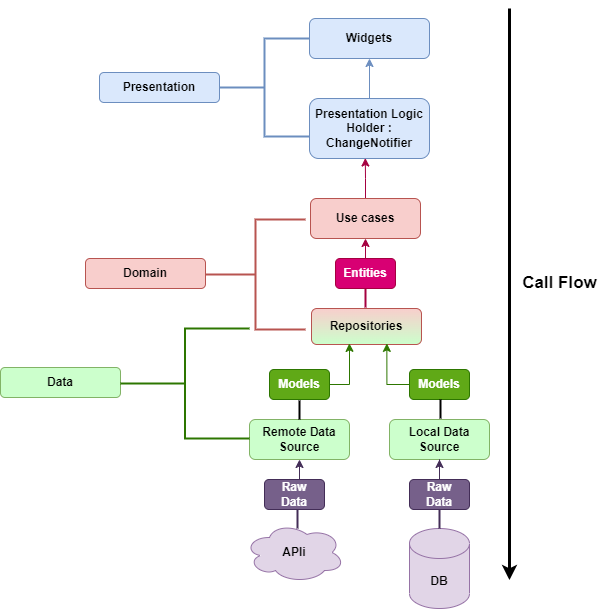

# Flutter Video Player App

A feature-rich video player application built with Flutter demonstrating clean architecture principles, Supabase backend integration, and modern state management using BLoC pattern.



## 📱 Features

- Video playback with essential controls
- CRUD operations for video management
- Clean Architecture implementation
- Feature-based project structure
- Dependency injection using get_it
- State management with BLoC pattern
- Cloud storage and database with Supabase

## 🏗️ Architecture Overview

The application follows Clean Architecture principles with three main layers:

### Presentation Layer

- Contains UI components and BLoC implementations
- Feature-based organization for better scalability
- Widgets are organized by feature modules

### Domain Layer

- Contains business logic and use cases
- Defines repository interfaces
- Contains entity models

### Data Layer

- Implements repository interfaces
- Handles data sources (Supabase)
- Contains data models and mappers

## 🛠️ Tech Stack

- **Flutter:** UI framework
- **BLoC:** State management
- **get_it:** Dependency injection
- **Supabase:** Backend as a Service
  - Authentication
  - Real-time database
  - File storage

## 📂 Project Structure

```
lib/
├── core/
│   ├── di/
│   │   └── injection_container.dart
│   ├── error/
│   │   └── failures.dart
│   └── utils/
├── features/
│   └── auth/
│       ├── data/
│       │   ├── datasources/
│       │   ├── models/
│       │   └── repositories/
│       ├── domain/
│       │   ├── entities/
│       │   ├── repositories/
│       │   └── usecases/
│       └── presentation/
│           ├── bloc/
│           ├── pages/
│           └── widgets/
└── main.dart
```

## 🚀 Getting Started

### Prerequisites

- Flutter (version X.X.X or higher)
- Supabase account and project
- IDE (VS Code, Android Studio, etc.)

### Installation

1. Clone the repository:

```bash
git clone https://github.com/yourusername/video_player_app.git
```

2. Install dependencies:

```bash
cd video_player_app
flutter pub get
```

3. Configure Supabase:
   - Create a `.env` file in the root directory
   - Add your Supabase credentials:

```
SUPABASE_URL=your_supabase_url
SUPABASE_ANON_KEY=your_supabase_anon_key
```

4. Run the app:

```bash
flutter run
```

## 🔧 Configuration

### Supabase Setup

1. Create a new Supabase project
2. Set up the following tables:

   - videos
     - id (uuid)
     - title (varchar)
     - description (text)
     - url (varchar)
     - created_at (timestamp)
     - updated_at (timestamp)

3. Configure storage buckets for video files

### Environment Variables

Create a `.env` file with the following variables:

```
SUPABASE_URL=your_supabase_url
SUPABASE_ANON_KEY=your_supabase_anon_key
```

## 🧪 Testing

The project includes unit tests, widget tests, and integration tests:

```bash
# Run all tests
flutter test

# Run specific test file
flutter test test/features/video_player/domain/usecases/get_videos_test.dart
```

## 📱 Screenshots

[Add screenshots of your app here]
